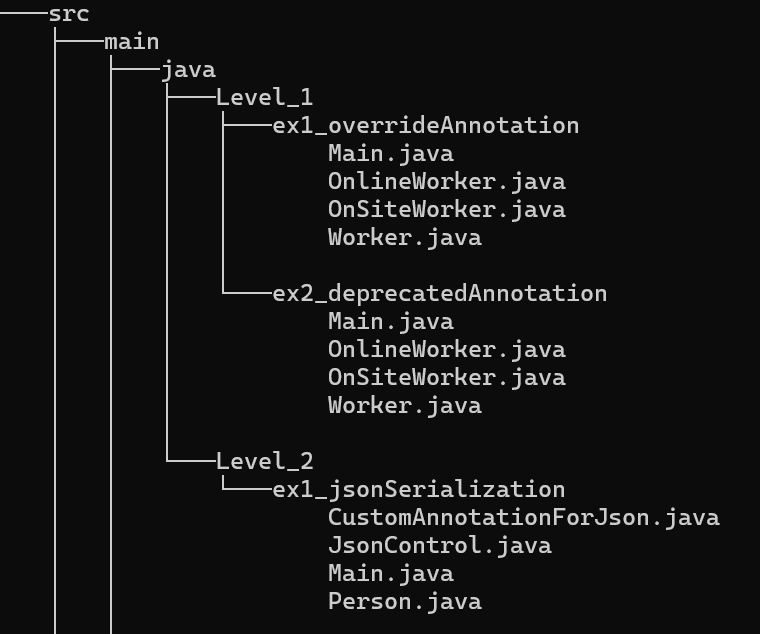

# Annotations

El objetivo de este proyecto es aprender a utilizar anotaciones en Java, tanto las anotaciones integradas como las anotaciones personalizadas.

## Estructura del proyecto

## Tecnologías

* Java 21
* IntelliJ IDEA
* Maven
* Jackson

## Instalación y Ejecución:
* Clonar el repositorio.
* Abrir en IntelliJ o Eclipse.
* Ejecutar Main.java.
## Nivel 1

### Ejercicio 1 - OverrideAnnotation

Las clases `OnlineWorker` y `OnSiteWorker` sobrescriben el método `calculateSalary()` de la clase `Worker` utilizando la anotación `@Override`.

Cada tipo de trabajador calcula su sueldo de forma diferente según sus atributos.

### Ejercicio 2 - DeprecatedAnnotation

Se añaden métodos obsoletos utilizando la anotación `@Deprecated`.

## Nivel 2

### Ejercicio 1 - JsonSerialization

Se crea una anotación personalizada para indicar que un objeto Java debe ser serializado en formato JSON.

La anotación recibe el directorio donde se guardará el archivo resultante.
